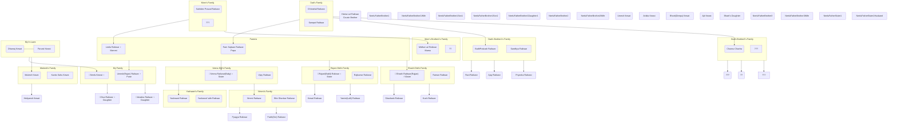

## My Family Tree

```mermaid
flowchart TB

DadFather("Chhotelal Raikwar")
DadMother["Sampat Raikwar"]

DadBrother1("BudhPrakash Raikwar")
DadBrother1Wife["Sandhya Raikwar"]
DadBrother1Son1("Ravi Raikwar")
DadBrother1Son2("Ajay Raikwar")
DadBrother1Daughter["Priyanka Raikwar"]

DadBrother2("Chunnu Chacha")
DadBrother2Wife["???"]
DadBrother2Son1("???")
DadBrother2Son2("??")
DadBrother2Daughter["???"]


MomFather("Sukhdev Prasad Raikwar")
MomMother["???"]

MomBrother1("Midhai Lal Raikwar\nMama")
MomBrother1Wife["??"]
MomBrother1Son("Heera Lal Raikwar\nCousin Brother")

%% my parents
Dad("Ram Sajiwan Raikwar\nPapa")
Mom["Leela Raikwar ♀\nMammi"]

NeeluFather("Dhanraj Kewat")
NeeluMother["Parvati Kewat"]
MukeshKewat("Mukesh Kewat")
KavitaSahu["Kavita Sahu Kewat"]
HridyanshKewat("Hridyansh Kewat")

NeeluFatherBrother1("NeeluFatherBrother1")
NeeluFatherBrother1Wife["NeeluFatherBrother1Wife"]

NeeluFatherBrother1Son1("NeeluFatherBrother1Son1")
NeeluFatherBrother1Son2("NeeluFatherBrother1Son2")
NeeluFatherBrother1Daughter1("NeeluFatherBrother1Daughter1")


NeeluFatherBrother2("NeeluFatherBrother2")
NeeluFatherBrother2Wife["NeeluFatherBrother2Wife"]

NeeluFatherBrother2Son1("Umesh Kewat")
NeeluFatherBrother2Son1Wife["Ankita Kewat"]

NeeluFatherBrother2Daughter1["Bharti(Deepu) Kewat"]
NeeluFatherBrother2Daughter1Husband("Ajit Kewat")
NeeluFatherBrother2Daughter1Daughter1["Bharti's Daughter"]


NeeluFatherBrother3("NeeluFatherBrother3")
NeeluFatherBrother3Wife["NeeluFatherBrother3Wife"]

NeeluFatherSister1["NeeluFatherSister1"]
NeeluFatherSister1Husband["NeeluFatherSister1Husband"]

UmeshRaikwar("Umesh(Rajan) Raikwar ♂\nPune")
NeeluKewat["👩Neelu Kewat ♀"]
DivaRaikwar["👧Diva Raikwar ♀\nDaughter"]
AriadnaRaiwkar["👧Ariadna Raikwar ♀\nDaughter"]

VeenaRaikwar["👩Veena Raikwar(Baby) ♀\nSister"]
VijayRaikwar("Vijay Raikwar")

YashwantRaikwar("Yashwant Raikwar")
YashwantWifeRaikwar("Yashwant' wife Raikwar")

NimmiRaikwar["Nimmi Raikwar"]
ShivShankarRaikwar("Shiv Shankar Raikwar")
PyagyaRaikwar["Pyagya Raikwar"]
ParthRaikwar("Parth(Om) Raikwar")

RajaniRaikwar["👩Rajani(Babli) Raikwar ♀\nSister"]
RajkumarRaikwar("Rajkumar Raikwar")
KewalRaikwar("Kewal Raikwar")
YaminiRaikwar["Yamini(Lalli) Raikwar"]

ShashiRaikwar["👩Shashi Raikwar(Rajjan) ♀\Sister"]
RamanRaikwar("Raman Raikwar")
ShashankRaikwar("Shashank Raikwar")
KushRaikwar("Kush Raikwar")

%% -- Relationships --
subgraph DadFamily["Dad's Family"]
    direction LR
    DadFather
    DadMother
end

subgraph MomFamily["Mom's Family"]
    direction LR
    MomFather
    MomMother
end

subgraph DadBrother1Family["Dad's Brother1's Family"]
    direction LR
    DadBrother1
    DadBrother1Wife
end

subgraph DadBrother2Family["Dad's Brother2's Family"]
    direction LR
    DadBrother2
    DadBrother2Wife
end

subgraph MomBrother1Family["Mom's Brother1's Family"]
    direction LR
    MomBrother1
    MomBrother1Wife
end

subgraph VeenaDidiFamily["Veena Didi's Family"]
    direction LR
    VijayRaikwar
    VeenaRaikwar    
end

subgraph NimmiFamily["Nimmi's Family"]
    direction LR
    ShivShankarRaikwar
    NimmiRaikwar    
end

subgraph YashwantFamily["Yashwant's Family"]
    direction LR
    YashwantRaikwar
    YashwantWifeRaikwar
end

subgraph RajaniDidiFamily["Rajani Didi's Family"]
    direction LR
    RajkumarRaikwar
    RajaniRaikwar 
end

subgraph ShashiDidiFamily["Shashi Didi's Family"]
    direction LR
    RamanRaikwar
    ShashiRaikwar
end

subgraph MyFamily["My Family"]
    direction LR
    UmeshRaikwar
    NeeluKewat
end

subgraph Parents
    direction LR
    Dad
    Mom
end

subgraph MyInLaw["My In-Laws"]
    direction LR
    NeeluFather
    NeeluMother
end

subgraph MukeshFamily["Mukesh's Family"]
    direction LR
    MukeshKewat
    KavitaSahu
end


Parents --> UmeshRaikwar & VeenaRaikwar & RajaniRaikwar & ShashiRaikwar
MyInLaw --> NeeluKewat & MukeshKewat
MyFamily --> DivaRaikwar & AriadnaRaiwkar
VeenaDidiFamily --> YashwantRaikwar & NimmiRaikwar
RajaniDidiFamily --> KewalRaikwar & YaminiRaikwar
MukeshFamily --> HridyanshKewat
NeeluFather --- NeeluMother
NimmiFamily --> PyagyaRaikwar & ParthRaikwar
ShashiDidiFamily --> ShashankRaikwar & KushRaikwar
DadFamily --> Dad & DadBrother1 & DadBrother2
DadBrother1Family --> DadBrother1Son1 & DadBrother1Son2 & DadBrother1Daughter
DadBrother2Family --> DadBrother2Son1 & DadBrother2Son2 & DadBrother2Daughter
MomFamily --> Mom & MomBrother1
```
